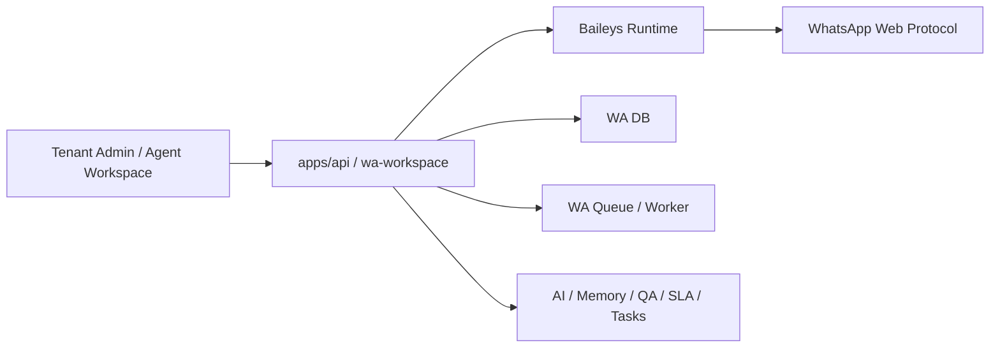
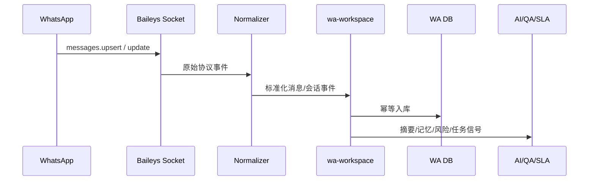
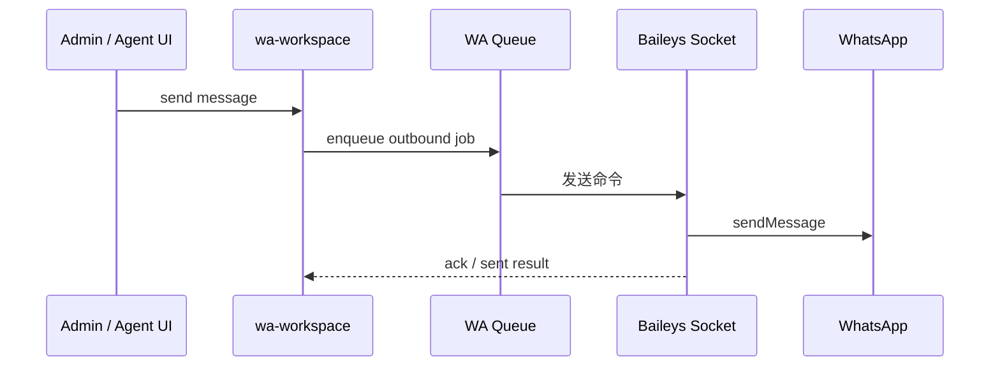
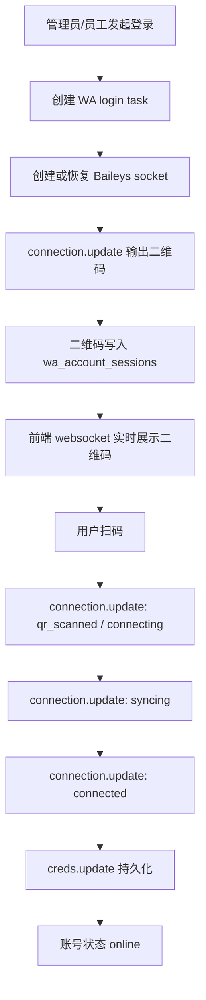
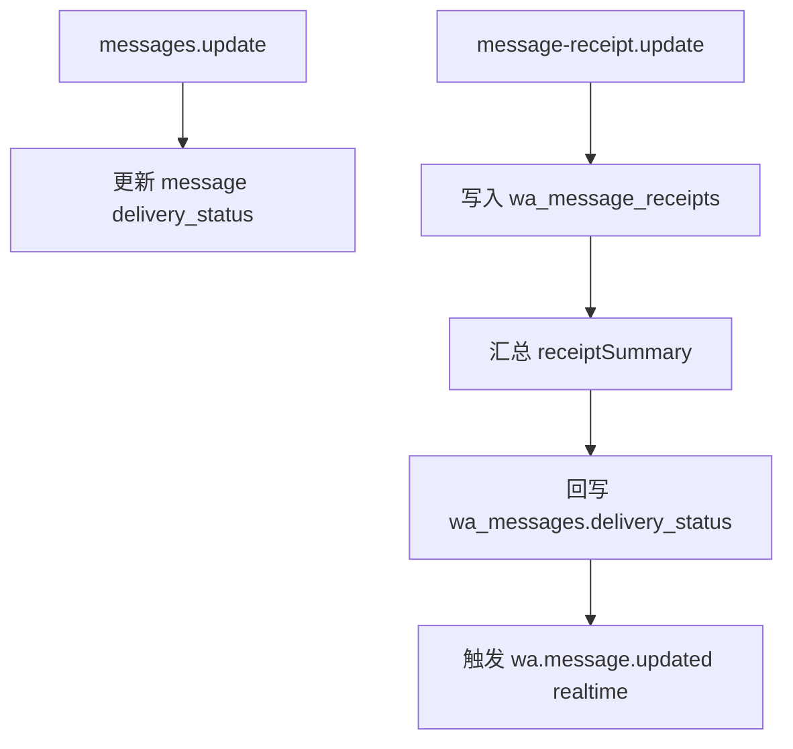

# WhatsApp 独立员工沟通模块方案

## 版本记录

| 版本 | 日期 | 作者 | 变更 |
| --- | --- | --- | --- |
| v1.7 | 2026-04-06 | Codex | 会话列表改为后端统一提供联系人名、联系人电话、未读数与新消息变更；新增 `wa_conversations.contact_name/contact_phone_e164/unread_count`，接入 Baileys `contacts.upsert / contacts.update / chats.upsert / chats.update / messages.upsert`，工作台不再自行推断标题与未读态 |
| v1.6 | 2026-04-06 | Codex | 修正 Baileys runtime 接入参数：登录后改用桌面 browser + `syncFullHistory=true`，补 `getMessage` 回查已存消息，并为 `history/chats/groups` 初始化同步增加兜底收口，避免账号长期卡在 `同步消息` |
| v1.5 | 2026-04-06 | Codex | 统一账号列表、健康接口、登录任务、实时事件的状态枚举为同一套 `uiStatus/actions/syncStatus`；登录弹窗在 `connected` 即关闭，后台同步阶段改在列表与工作台展示，并按 `history/chats/groups` 事件细分为 `syncing_history / syncing_chats / syncing_groups / ready` |
| v1.4 | 2026-04-06 | Codex | 登录状态机补全：管理端扫码弹窗改为实时展示 `qr_required / qr_scanned / connecting / syncing / connected / failed`，状态从 Baileys `connection.update` 持续写入 `wa_account_sessions.session_meta` 并通过 `wa.account.updated` 推送；首次扫码配对成功后按 Baileys `isNewLogin` 语义自动重启 socket 完成最终登录 |
| v1.3 | 2026-04-05 | Codex | Phase E 开始实施：新增 `wa.account.updated` / `wa.message.updated` 实时推送，`message-receipt.update` 已落 `wa_message_receipts`，Baileys 多文件 session 新增 DB 快照表 `wa_baileys_auth_snapshots`，管理端扫码弹窗与 WA 工作台改为 websocket 驱动 |
| v1.2 | 2026-04-05 | Codex | Phase C/D 已开始实施：Baileys `messages.upsert` / `messages.update` 已接入 WA 入库链路，出站 worker 切到 `sendMessage`，扫码/连接/creds 状态通过 session 表实时反映给管理端与工作台 |
| v1.1 | 2026-04-05 | Codex | Phase B 开始实施：已接入 Baileys 依赖，新增 runtime 骨架，登录/重连链路切换到项目内 Baileys manager，移除 Evolution webhook 路径 |
| v1.0 | 2026-04-05 | Codex | 明确放弃外置 Evolution 运行时，改为在 `apps/api` 内直接集成 `@whiskeysockets/baileys`；删除 Evolution 相关设计，重写接入层、运行时、环境变量与重构清单 |

## 1. 为什么做 + 做什么

### 1.1 目标

- 在现有系统内建设独立的 `WA Workspace` 模块
- 员工像使用 WhatsApp Web 一样登录、查看私聊/群聊、直接沟通
- 与当前官方客服渠道彻底分层，不混用数据库、服务、队列、会话模型
- 支持一个 WA 号码由多个员工协同查看，但同一时刻只能一个员工回复
- 支持后续 AI Copilot、摘要、风险检测、QA、SLA、任务联动

### 1.2 核心决策

- 不再依赖外置 `Evolution API`
- 直接在 `apps/api` 内集成 `@whiskeysockets/baileys`
- `wa-workspace` 继续作为独立业务域保留
- WhatsApp 接入运行时改为项目内嵌 `Baileys Runtime`

### 1.3 结论

新的实际架构：



含义：

- `wa-workspace` 是业务编排层
- `Baileys Runtime` 是接入层
- 两者都在我们自己的 `apps/api` 进程体系内
- 不再额外依赖外置 WhatsApp 网关服务

## 2. 技术实现路径

### 2.1 接入层

- 在 `apps/api` 中安装 `@whiskeysockets/baileys`
- 为每个 WA 号码维护一个独立 Baileys 实例
- 实例运行时由 `Map<waAccountId, socketRuntime>` 管理
- 多进程/多机扩展时，实例 owner 与 session 状态放入 Redis/DB 协调

### 2.2 事件监听

必须接入的核心事件：

| 事件 | 用途 |
| --- | --- |
| `connection.update` | 登录状态、二维码、断线、重连 |
| `creds.update` | session/密钥持久化 |
| `messages.upsert` | 新消息入站 |
| `messages.update` | ack、已读、编辑、撤回等状态更新 |
| `message-receipt.update` | 回执与送达状态 |
| `groups.update` | 群信息变化 |
| `group-participants.update` | 群成员变化 |
| `chats.update` | chat 元数据变化 |

### 2.3 消息流



### 2.4 发送流



### 2.5 与现有系统打通

- 每个 `channel_identifier` 或 `wa_account_id` 对应一个独立 Baileys 实例
- 入站消息标准化后进入现有 `UnifiedMessage -> RoutingContext` 链路
- 发送消息通过现有 `wa_outbound_jobs` + worker 发送，但底层改为 Baileys `sendMessage`
- 账号池、会话接管、Copilot、QA、SLA、任务仍保留在现有 `wa-workspace` 域

## 3. 规范原则

| 原则 | 落地要求 |
| --- | --- |
| 独立业务域 | WA 数据、队列、服务与官方客服渠道分开 |
| 单一回复者 | 同一会话同一时刻只允许一个员工回复 |
| 消息最终一致 | 幂等、缺口检测、历史补偿、顺序修复 |
| 运行时内嵌 | WhatsApp 接入能力运行在 `apps/api` 内，而不是外置服务 |
| session 持久化 | 员工退出系统不等于 WA 退出 |
| 多号码支持 | 一个号码一个实例，多号码并存 |
| AI 可复用 | WA 消息天然进入摘要、风险、QA、SLA、任务链路 |

## 4. 详细设计

### 4.1 数据模型 / 表结构

现有 WA 表结构继续保留，重点不在表重做，而在接入层替换。

#### 4.1.1 保留表

| 表名 | 用途 |
| --- | --- |
| `wa_accounts` | WA 号码与运行时主表 |
| `wa_account_sessions` | 二维码、连接状态、session 信息 |
| `wa_baileys_auth_snapshots` | Baileys auth 快照，供重启/迁移恢复 |
| `wa_account_members` | 号码与员工绑定 |
| `wa_login_tasks` | 登录任务 |
| `wa_conversations` | 私聊/群聊会话 |
| `wa_conversation_members` | 群成员 |
| `wa_messages` | 标准消息主表 |
| `wa_message_raw_events` | 原始事件 |
| `wa_message_attachments` | 附件 |
| `wa_message_reactions` | 表情 |
| `wa_message_receipts` | 每条消息的用户回执 |
| `wa_message_gaps` | 缺口补偿 |
| `wa_assignment_locks` | 接管锁 |
| `wa_assignment_history` | 接管历史 |
| `wa_outbound_jobs` | 出站任务 |

#### 4.1.2 字段调整建议

| 表 | 字段 | 调整 |
| --- | --- | --- |
| `wa_accounts` | `provider_key` | 默认值改为 `baileys` |
| `wa_account_sessions` | `session_provider` | 默认值改为 `baileys` |
| `wa_account_sessions` | `session_meta` | 保存 `credsUpdatedAt`、`qrCode`、`disconnectReason` |
| `wa_baileys_auth_snapshots` | `snapshot_payload` | 保存多文件 auth state 的最新 DB 快照 |
| `wa_conversations` | `contact_name` | 直接会话联系人名称，优先来自 `contacts.upsert/update`，缺失时回退 `pushName` |
| `wa_conversations` | `contact_phone_e164` | 直接会话手机号，统一给工作台展示 |
| `wa_conversations` | `unread_count` | 当前 WA 设备视角未读数，用于列表红点与新消息提示 |
| `wa_messages` | `provider_payload` | 保留，用于 Baileys 原始事件存档 |
| `wa_message_receipts` | 全表 | 保存用户级 delivered/read/played 明细 |

### 4.2 私聊结构 / 群聊结构

| 类型 | chat_jid 规则 | 特点 |
| --- | --- | --- |
| 私聊 | `xxx@s.whatsapp.net` | 1 对 1 |
| 群聊 | `xxx@g.us` | 多成员，需维护 participant |

消息结构统一：

```ts
type WaNormalizedMessage = {
  providerMessageId: string;
  chatJid: string;
  participantJid?: string | null;
  senderJid?: string | null;
  direction: "inbound" | "outbound";
  messageType: "text" | "image" | "video" | "audio" | "document" | "reaction" | "system";
  bodyText?: string | null;
  quotedMessageId?: string | null;
  reactionEmoji?: string | null;
  reactionTargetId?: string | null;
  attachment?: {
    attachmentType: "image" | "video" | "audio" | "document";
    mimeType?: string | null;
    fileName?: string | null;
    fileSize?: number | null;
    storageUrl?: string | null;
  } | null;
  providerTs: number;
  providerPayload: unknown;
};
```

### 4.3 消息存储与记忆

#### 4.3.1 消息分层

| 层 | 内容 | 用途 |
| --- | --- | --- |
| 原始事件层 | Baileys 原始事件 | 协议追溯、调试、补偿 |
| 标准消息层 | `wa_messages` | 工作台、查询、审计 |
| 业务信号层 | 风险、QA、SLA、任务事件 | 智能处理 |
| 记忆层 | 短期记忆、长期记忆 | Copilot / 摘要 / 助手 |

#### 4.3.2 谁发的要区分

| 场景 | `direction` | `sender_role` | 说明 |
| --- | --- | --- | --- |
| 客户/群成员发言 | `inbound` | `customer` / `group_member` | 外部消息 |
| 员工回复 | `outbound` | `member` | 明确是谁回复 |
| 系统备注/Copilot | `internal` 或 `message_scene=internal_note` | `system` | 不发给 WA |

#### 4.3.3 记忆设计

短期记忆：

- 最近 N 条消息
- 当前接管人
- 最近风险标签
- 当前任务与 SLA 状态

长期记忆：

- 客户长期偏好
- 历史投诉模式
- 常见问题与处理结果
- 群聊关键参与者关系

### 4.4 核心流程

#### 4.4.1 登录流程



步骤：

1. 创建 login task
2. 拉起对应 `waAccountId` 的 Baileys 实例
3. 把二维码写到 `wa_account_sessions.session_meta.qrCode`
4. 通过 `wa.account.updated` 推送给管理端/工作台
5. 登录阶段统一写入 `wa_account_sessions.session_meta.loginPhase`
6. 管理端弹窗按阶段展示：
   - `qr_required`: 显示二维码
   - `qr_scanned`: 已扫码，等待手机确认
   - `connecting`: 正在建立连接
   - `connected`: 登录成功，自动关闭弹窗
   - `failed`: 登录失败，要求重新扫码
7. 弹窗只承载登录态，不承载后台同步态；一旦账号进入 `connected`，后续 `history/chats/groups` 初始化同步改在账号列表和 WA 工作台通过 `syncStatus` 展示
8. 后端统一输出：
   - `uiStatus`: 登录与在线展示态
   - `syncStatus`: 后台同步阶段
   - `actions`: 当前账号可执行动作
9. `syncStatus` 的细分规则：
   - `syncing_history`: 已登录，正在同步历史消息
   - `syncing_chats`: 已登录，正在同步聊天列表
   - `syncing_groups`: 已登录，正在同步群聊/群成员
   - `ready`: 初始化同步完成
10. 首次扫码配对成功后，若 Baileys 发出 `isNewLogin: true`，服务端自动保存 creds 并重启当前 socket，继续完成最终登录
11. `creds.update` 先写多文件目录，再把目录快照同步到 `wa_baileys_auth_snapshots`
12. 为了拿到完整初始化同步事件，socket 按 Baileys 官方建议使用桌面 browser，并开启 `syncFullHistory`
13. `getMessage` 通过已落库消息回查，避免消息重试/补发场景缺失消息体
14. 若 `messaging-history.set / chats.update / groups.update` 在初始化窗口内未全部到达，运行时会按当前已知状态自动收口同步阶段，避免账号永久卡在 `同步消息`

#### 4.4.2 入站消息流程

1. Baileys 收到 `messages.upsert`
2. 进入标准化器
3. 幂等落入 `wa_message_raw_events`
4. upsert conversation
5. insert message / attachment / reaction / member

#### 4.4.3 回执与状态流



规则：

- `messages.update` 负责 message 级状态推进
- `message-receipt.update` 负责用户级 delivered/read/played 明细
- UI 默认展示 `deliveryStatus`，群聊可进一步消费 `receiptSummary`

### 4.5 实时推送

| 事件 | 用途 | 消费端 |
| --- | --- | --- |
| `wa.account.updated` | 二维码、连接态、断线、重连 | 租户管理端、WA 工作台 |
| `wa.conversation.updated` | 联系人名称、手机号、未读数、最新摘要、新消息到达 | WA 工作台 |
| `wa.message.updated` | 出站 ack/read/played 更新 | WA 工作台 |

说明：

- 继续复用现有 Socket.IO tenant room
- 不额外引入新网关
- 管理端扫码弹窗只处理登录态；连接成功后立即关闭
- 后台同步态由账号列表与 WA 工作台持续展示，不阻塞用户操作
6. 若引用消息缺失，记录 `wa_message_gaps`
7. 写入记忆、QA、SLA、任务信号

#### 4.4.3 出站消息流程

1. 前端调用发送接口
2. 写入 `wa_outbound_jobs`
3. worker 获取会话当前接管人校验
4. 通过 Baileys `sendMessage` 发送
5. 回写 `wa_messages` / delivery status

### 4.5 接口 / API 设计

#### 4.5.1 管理端

| 路径 | 方法 | 作用 |
| --- | --- | --- |
| `/api/admin/wa/accounts` | GET | WA 账号列表 |
| `/api/admin/wa/accounts` | POST | 创建 WA 账号 |
| `/api/admin/wa/accounts/:waAccountId/login-task` | POST | 创建登录任务 |
| `/api/admin/wa/accounts/:waAccountId/health` | GET | 查询账号健康 |
| `/api/admin/wa/accounts/:waAccountId/reconnect` | POST | 触发重连 |
| `/api/admin/wa/accounts/:waAccountId/assign-members` | POST | 分配协同成员 |
| `/api/admin/wa/accounts/:waAccountId/owner` | PATCH | 设置负责人 |

#### 4.5.2 工作台

| 路径 | 方法 | 作用 |
| --- | --- | --- |
| `/api/wa/workbench/accounts` | GET | 当前员工可见账号 |
| `/api/wa/workbench/accounts/:waAccountId/login-task` | POST | 员工扫码登录 |
| `/api/wa/workbench/conversations` | GET | 会话列表 |
| `/api/wa/workbench/conversations/:waConversationId` | GET | 会话详情 |
| `/api/wa/workbench/conversations/:waConversationId/takeover` | POST | 接管 |
| `/api/wa/workbench/conversations/:waConversationId/release` | POST | 释放 |
| `/api/wa/workbench/conversations/:waConversationId/messages` | POST | 发送文本/媒体/引用 |
| `/api/wa/workbench/messages/:waMessageId/reaction` | POST | 发送 reaction |
| `/api/wa/workbench/uploads` | POST | 上传附件 |

#### 4.5.3 内部运行时

| 路径 | 方法 | 作用 |
| --- | --- | --- |
| `/internal/wa/runtime/accounts/:waAccountId/connect` | POST | 拉起或恢复 socket |
| `/internal/wa/runtime/accounts/:waAccountId/disconnect` | POST | 断开 socket |
| `/internal/wa/runtime/accounts/:waAccountId/reconcile` | POST | 历史补偿 |

说明：

- 不再保留 `/internal/wa/evolution/...` webhook 入口
- 接入层不走第三方 webhook，而由本进程直接消费 Baileys 事件

### 4.6 前端 / UI 变化

#### 4.6.1 管理端

菜单位置不变：

- `系统设置 -> 坐席与成员管理 -> WA账号管理`
- `系统设置 -> 坐席与成员管理 -> 成员账号 -> WhatsApp座席`

界面要求：

- 展示号码在线状态
- 展示统一 `uiStatus / syncStatus`
- 支持扫码登录
- 支持协同成员分配
- 支持负责人设置
- 展示最近连接/掉线状态

#### 4.6.2 工作台

- `WA 工作台 / 会话列表 / 消息详情 / 右侧上下文`
- 账号筛选直接消费后端统一返回的 `uiStatus / syncStatus / actions`
- 会话列表直接消费后端返回的 `displayName / contactPhoneE164 / unreadCount / lastMessagePreview`
- 实时变化通过 `wa.conversation.updated` 触发列表与当前会话刷新，前端不自行推断姓名、电话、未读数
- 展示当前谁在回复
- 不可回复者只能查看或提示
- 支持文本、图片、文件、引用回复、reaction

### 4.7 后端 / 逻辑实现

#### 4.7.1 运行时模块

建议新增：

| 文件/目录 | 作用 |
| --- | --- |
| `wa-runtime/baileys-runtime.manager.ts` | 管理所有号码实例 |
| `wa-runtime/baileys-socket.factory.ts` | 创建 socket |
| `wa-runtime/baileys-auth.repository.ts` | 持久化 creds / keys |
| `wa-runtime/baileys-event.consumer.ts` | 监听并转标准事件 |
| `wa-runtime/baileys-message.mapper.ts` | 原始消息标准化 |
| `wa-runtime/baileys-send.service.ts` | sendMessage 封装 |

#### 4.7.2 session 管理

- 单机先用内存 `Map`
- creds / keys 持久化到 DB 或文件系统
- 多机时通过 Redis 锁控制谁持有某个号码实例

#### 4.7.3 自动重连

| 风险 | 缓解 |
| --- | --- |
| 协议变化导致断连 | 定期更新 Baileys |
| 进程重启导致 session 丢失 | `creds.update` 持久化 |
| 多实例重复连接 | 加账号级分布式锁 |
| 消息顺序错乱 | `provider_ts + logical_seq + gap reconcile` |

### 4.8 与现有系统的集成 / 桥接

| 模块 | 集成方式 |
| --- | --- |
| Auth / Membership | 继续复用现有登录体系 |
| WA Seat | 继续用 `tenant_memberships.wa_seat_enabled` |
| AI Copilot | WA 消息进入摘要/记忆链路 |
| QA | 根据 WA 消息和员工回复做质检 |
| SLA | 对 WA 会话计算响应风险 |
| Tasks | 从 WA 会话创建/更新任务 |

### 4.9 AI / 特殊模块设计

#### 4.9.1 Copilot 输入

```ts
{
  conversation: {...},
  recentMessages: [...],
  shortMemory: [...],
  longMemory: [...],
  currentAssignee: {...},
  riskSignals: [...],
  qaSignals: [...],
  slaSignals: [...]
}
```

#### 4.9.2 风险检测

| 类型 | 说明 |
| --- | --- |
| 投诉词 | 识别高风险投诉表达 |
| 情绪分析 | 识别 angry / negative / urgent |
| SLA 风险 | 长时间未回复、关键客户未处理 |

#### 4.9.3 自动摘要

- 私聊摘要
- 群聊摘要
- 每日总结

## 5. 重构清单

### 5.1 必须删除或替换

| 现有位置 | 动作 |
| --- | --- |
| `apps/api/src/modules/wa-workspace/provider/evolution/*` | 整目录删除 |
| `apps/api/src/modules/wa-workspace/wa-provider-webhook.service.ts` | 改为 Baileys 事件入站服务 |
| `apps/api/src/modules/wa-workspace/wa-internal.routes.ts` | 删除 Evolution webhook 路径，改成内部 runtime 控制入口 |
| `apps/api/src/modules/wa-workspace/provider/provider-registry.ts` | 改为注册 `baileys` adapter |
| `apps/api/src/modules/wa-workspace/wa-runtime.service.ts` | 改为判断 Baileys runtime 是否已启用，而不是检查 Evolution env |
| `apps/api/.env.example` 中 `WA_EVOLUTION_*` | 删除 |

### 5.2 必须重构

| 现有位置 | 重构方向 |
| --- | --- |
| `wa-admin.service.ts` | 登录任务改为拉起 Baileys 实例并返回二维码 |
| `wa-workbench.service.ts` | 员工登录任务改为直接调用 Baileys runtime |
| `wa-outbound.service.ts` | 出站 payload 改为 Baileys `sendMessage` 标准命令 |
| `wa-outbound.worker.ts` | worker 调用 Baileys send service |
| `wa-reconcile.service.ts` | 历史补偿改为 Baileys 历史能力 |
| `wa-account.repository.ts` | `provider_key/session_provider` 默认值改为 `baileys` |
| `wa-admin.routes.ts` | runtime health 改为项目内接入状态 |
| `wa-workbench.routes.ts` | runtime/登录态判断改为 Baileys 可用性 |

### 5.3 新增模块

| 新位置 | 用途 |
| --- | --- |
| `apps/api/src/modules/wa-workspace/runtime/*` | Baileys 实例管理 |
| `apps/api/src/modules/wa-workspace/provider/baileys/*` | Baileys 适配层 |
| `apps/api/src/workers/wa-runtime.worker.ts` | 可选，承载常驻连接管理 |

## 6. Phase 拆分

| 阶段 | 范围 | 输出 |
| --- | --- | --- |
| Phase A | 删除 Evolution 设计、重建 runtime 抽象 | 文档、env、代码清单 |
| Phase B | 接入 Baileys 登录与 session 持久化 | 二维码登录、重连、在线状态 |
| Phase C | 入站消息标准化与会话同步 | 已开始：`messages.upsert` / `messages.update` 入库 |
| Phase D | 出站文本/媒体/reaction | 已开始：worker 已切到 Baileys `sendMessage` |
| Phase E | 历史补偿、记忆、QA、SLA、任务 | 智能化闭环 |

## 7. 结论

最终方向已经明确：

- 放弃外置 Evolution 运行时
- 保留 `wa-workspace` 业务域
- 在 `apps/api` 内直接集成 `Baileys`
- 用项目自身承载多号码实例、session、消息监听、发信、重连与补偿

这样更符合本项目的真实目标：

- WA 是系统内部的独立模块
- 不依赖额外外部网关服务
- 登录、消息、协同、AI 都统一落在我们的后端体系内

## 8. 参考

- [Baileys GitHub](https://github.com/WhiskeySockets/Baileys)
- [Baileys Socket Config](https://baileys.wiki/docs/socket/configuration/)
- [Baileys History Sync](https://baileys.wiki/docs/socket/history-sync/)
- [Baileys Receiving Updates](https://baileys.wiki/docs/socket/receiving-updates/)
