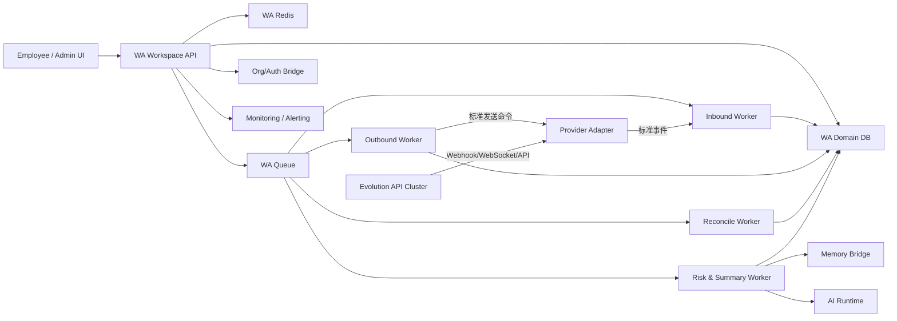
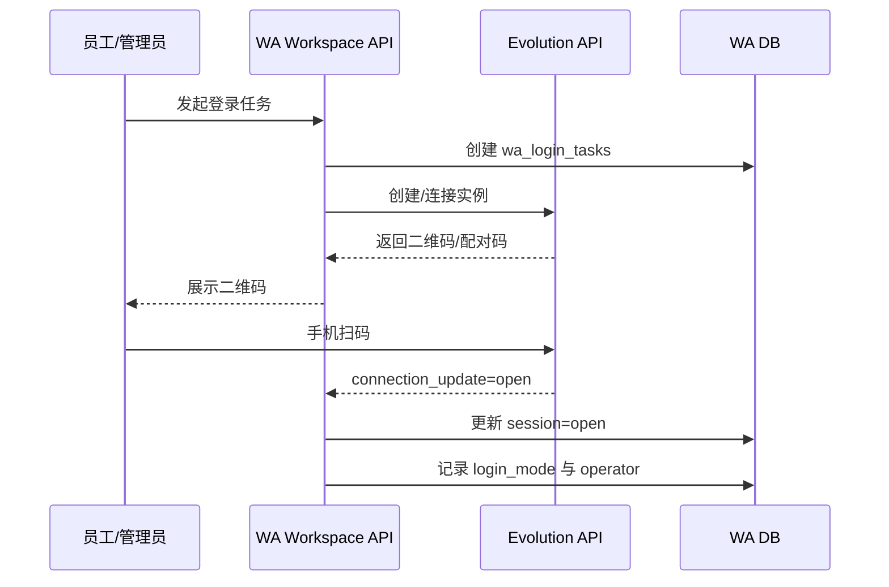
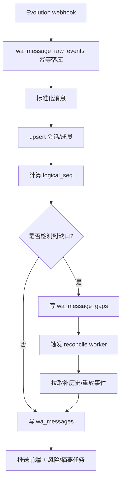
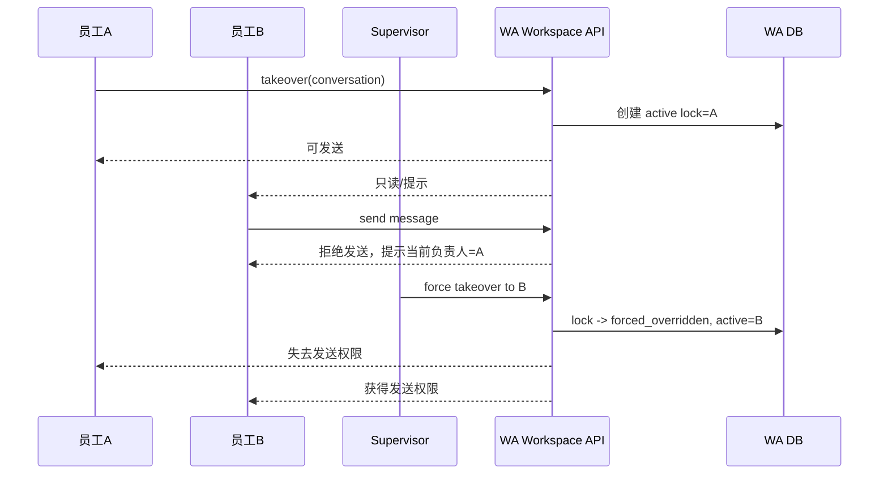
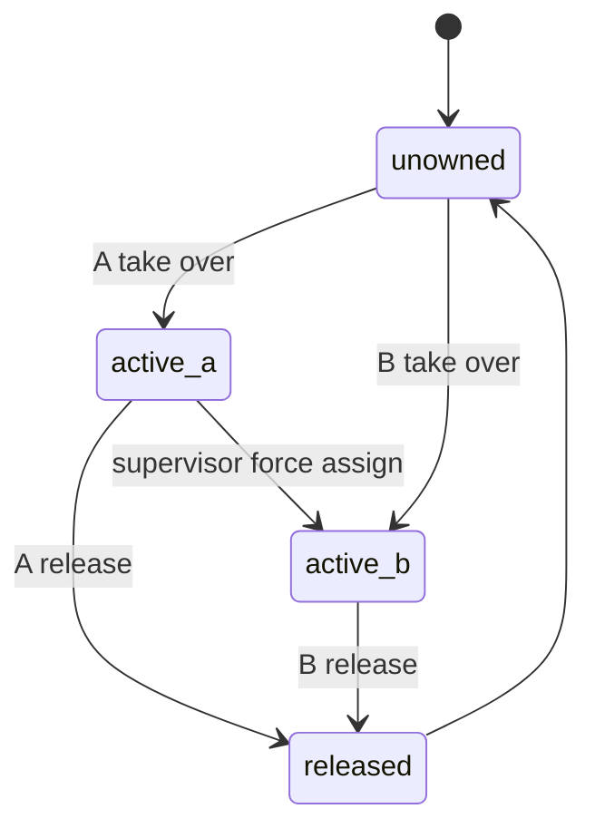
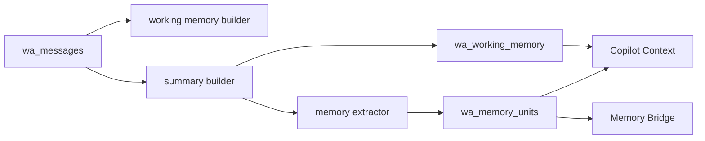

# WhatsApp 独立员工沟通模块方案

## 版本记录

| 版本 | 日期 | 作者 | 变更 |
| --- | --- | --- | --- |
| v0.11 | 2026-04-05 | Codex | 补充 Evolution 环境变量落地说明：生产部署、本地 `.env` 示例、变量来源与回调地址要求 |
| v0.10 | 2026-04-05 | Codex | 移除未配置 Evolution 时的占位二维码回退，改为明确报错；避免前端继续展示非 WhatsApp 的伪登录码 |
| v0.9 | 2026-04-05 | Codex | 修正 Evolution 登录回调链路：每次登录显式重设 webhook，改为统一回调地址并通过 query 传租户，内部同时兼容事件后缀路径，避免扫码阶段的 `QRCODE_UPDATED` / `CONNECTION_UPDATE` 被打丢 |
| v0.8 | 2026-04-05 | Codex | 修正扫码实现：登录二维码优先使用 provider 返回的可扫描图像数据（如 `qrOrCode` / base64），避免把非扫码文本误渲染成二维码 |
| v0.7 | 2026-04-05 | Codex | 补充实际实现：管理端扫码登录弹窗已支持二维码渲染、连接状态轮询、二维码自动刷新、连接成功自动关闭并刷新账号状态 |
| v0.6 | 2026-04-05 | Codex | 补充实际进度：agent-workspace 已接入 WA 工作台路由与页面骨架，Evolution webhook 解析增强为兼容 event/data/key/message 结构，历史补拉尝试对接 `findMessages` |
| v0.5 | 2026-04-05 | Codex | 补充实际开发进度：webhook 缺口记录与 reconcile 骨架、管理端入口并入坐席与成员管理、成员 WA Seat 与 WA 账号池联动维护 |
| v0.4 | 2026-04-05 | Codex | 补充 Phase 2 已推进项：富媒体发送、reaction、群成员同步、WA 上传入口、Phase 2 表结构 |
| v0.3 | 2026-04-05 | Codex | 按实际实现补充：WA Seat 权限标记、Phase 1 已落地范围、独立 WA 出站队列/worker、Evolution 命令接入约束 |
| v0.2 | 2026-04-05 | Codex | 补充 provider 抽象层、富媒体消息模型、消息存储分层、短期/长期记忆、QA/SLA/任务准备设计 |
| v0.1 | 2026-04-05 | Codex | 初版方案：独立 WA 员工沟通模块、技术选型、数据模型、流程、API、UI、AI 与实施分期 |

## 1. 为什么做 + 做什么

### 1.1 目标

建设一套独立的 WhatsApp 员工沟通模块，满足以下目标：

- 员工像使用 WhatsApp Web 一样登录后直接查看并参与私聊、群聊
- 与当前官方客服渠道完全分层，不混用数据库、服务、队列、会话模型
- 支持一个 WA 号被多个员工协同使用，但同一时刻只能一个员工实际回复
- 支持管理员与员工双入口登录，且系统登出不影响 WA 会话保持
- 支持 AI Copilot、自动摘要、风险检测、可见范围控制、掉线监控与账号池管理

### 1.2 不做什么

- 不替代当前官方 WhatsApp Business/客服渠道
- 不接入现有客服会话调度模型，不参与客户会话分单
- 不把员工 WA 沟通记录混入当前坐席消息主表

### 1.3 结论

建议采用：

- `Evolution API` 作为首个接入实现，不作为内部稳定协议
- 新建独立域：`WA Workspace`
- 独立资源：数据库、Redis、队列、Worker、监控、告警
- 内部通过统一适配层隔离第三方协议，避免业务代码直接依赖 Evolution payload

原因：

- 它已经具备实例化、扫码连接、连接状态、Webhook/WebSocket、群聊相关事件能力
- 比直接操控 Puppeteer 类库更适合服务化部署
- 比直接使用 Baileys 更快落地，适合先完成产品闭环
- 但 Meta 与第三方协议都可能变化，因此必须把 `provider adapter` 设计成可替换层

## 2. 选型分析

### 2.1 主流第三方 WhatsApp Web 模拟路线

| 方案 | 技术路径 | 优点 | 缺点 | 结论 |
| --- | --- | --- | --- | --- |
| Evolution API | 封装多实例、Webhook、连接管理的服务层 | 现成实例管理、Webhook、连接状态、便于多账号运营 | 仍属非官方链路，需自建可靠性与风控层 | 首选 |
| Baileys | 直接对接 WhatsApp Web 协议的 TS 库 | 协议层能力强，可控度高，支持历史同步 | 开发复杂度高，需要自己补齐会话管理/重连/事件治理 | 作为二阶段兜底适配器 |
| whatsapp-web.js | Puppeteer 驱动 WhatsApp Web | 功能全，社区成熟 | 浏览器资源重，规模化运维成本高，封禁风险明显 | 不建议作为主生产底座 |
| WPPConnect Server | Puppeteer + 服务端 API 封装 | 多 Session、Webhook、接口现成 | 仍强依赖浏览器/Chrome，资源与稳定性压力较大 | 可参考，不选主线 |
| open-wa | Puppeteer/浏览器自动化 | 功能丰富，支持多会话 | 商业化与版本兼容管理更重，仍属浏览器模拟 | 不选主线 |

### 2.2 关键事实

| 事实 | 说明 |
| --- | --- |
| Evolution API 支持实例创建 | 文档提供 `POST /instance/create` |
| Evolution API 支持扫码/配对码连接 | 文档提供 `GET /instance/connect/{instance}` |
| Evolution API 支持连接状态查询 | 文档提供 `GET /instance/connectionState/{instance}` |
| Evolution API 支持按实例 Webhook | 支持 `MESSAGES_UPSERT`、`MESSAGES_SET`、`CHATS_*`、`GROUPS_*`、`PRESENCE_UPDATE` 等 |
| Baileys 支持历史同步与按需补历史 | 提供 `messaging-history.set` 与 `fetchMessageHistory` |
| whatsapp-web.js/WPPConnect/open-wa 均为非官方 | 官方仓库明确声明与 WhatsApp 无官方关联，存在封禁风险 |

### 2.3 技术路线结论

建议分两层：

1. `接入层`
   首期使用 Evolution API 管理 WA 连接、扫码、消息事件、基础发信能力
2. `业务层`
   自建 WA Workspace 域，负责账号池、消息一致性、接管控制、Copilot、风控、权限与摘要

避免的问题：

- 业务逻辑与第三方事件格式强耦合
- 将 WA 沟通链路错误塞进当前客服 conversation/case/dispatch 模型
- 会话接管、群聊结构、消息补偿依赖第三方默认实现

### 2.4 Provider 抽象要求

核心原则：

- `Evolution API` 只是 `provider implementation`
- 内部一律面向 `provider-neutral contract`
- 后续切到 Baileys、自研适配器或其他 provider 时，不改业务域表结构与工作台 API

抽象边界：

| 层 | 输入/输出 | 说明 |
| --- | --- | --- |
| `provider webhook adapter` | 第三方原始 payload -> 标准事件 | 消息、连接、群变更、状态事件标准化 |
| `provider command adapter` | 内部发送命令 -> 第三方 API | 发文本、图片、文件、已读、typing、引用回复 |
| `provider session adapter` | 登录、扫码、重连、连接状态 | 屏蔽不同 provider 的 session 细节 |

标准事件模型：

```ts
type WaProviderEvent =
  | { type: "message.upsert"; accountRef: string; chatRef: string; payload: unknown }
  | { type: "message.ack"; accountRef: string; messageRef: string; payload: unknown }
  | { type: "chat.upsert"; accountRef: string; chatRef: string; payload: unknown }
  | { type: "group.participants"; accountRef: string; chatRef: string; payload: unknown }
  | { type: "session.state"; accountRef: string; state: string; payload: unknown };
```

替换要求：

- `wa_messages` 不存 provider 专属业务字段作为主查询字段
- provider 特有字段仅放 `provider_payload` 或 `payload_ext`
- 发送能力通过 `capability matrix` 判定，例如是否支持 reaction、quoted reply、read receipt

## 3. 范围与原则

### 3.1 范围

本模块覆盖：

- WA 账号池管理
- 扫码登录与会话保活
- 私聊/群聊收发与消息归档
- 会话接管与协同查看
- Copilot、摘要、风险检测
- 账号健康监控、自动重连、限速与发送行为模拟

### 3.2 设计原则

| 原则 | 落地要求 |
| --- | --- |
| 物理分层 | 独立数据库、Redis、队列、Worker、告警 |
| Provider 可替换 | Evolution API 升级或替换不破坏内部业务层 |
| 单一回复者 | 同一会话同一时刻只有一个 `active replier` |
| 消息最终一致 | 入库幂等、缺口检测、历史补偿、顺序重排 |
| 账号级风控 | 限速、节奏模拟、独立健康状态 |
| 会话常在线 | 员工退出业务系统不等于 WA 退出 |
| 最小桥接 | 只桥接组织权限、身份、AI 能力、记忆能力 |

### 3.3 核心对象

| 对象 | 含义 |
| --- | --- |
| WA 账号 | 一个真实 WhatsApp 号码，一个独立 session |
| WA 会话 | 一个 chat，对应私聊或群聊 |
| WA 消息 | 面向业务的标准消息，独立于 provider 原始 payload |
| 内部动作消息 | 员工备注、Copilot 建议、质检结论，不发给 WA |
| WA 成员 | 会话参与者；群聊含多人，私聊含对方联系人 |
| 会话负责人 | 当前允许发送消息的员工 |
| 观察者 | 可查看、可评论、可建议，不可直接发出消息 |

### 3.4 权限模型

| 权限对象 | 说明 |
| --- | --- |
| `tenant_memberships` | 基础租户成员身份 |
| `agent_profiles` | 现有客服坐席资格，控制能否进入客服系统 |
| `wa_seat_enabled` | WA 工作台资格，控制能否进入 WA 工作台 |

规则：

- 客服坐席资格与 WA 工作台资格分开
- 员工登录系统后，前端根据 `agentId` 和 `waSeatEnabled` 决定展示哪个工作台入口
- WA 工作台接口必须校验 `waSeatEnabled=true`
- 管理端不依赖 `wa_seat_enabled`，仍走后台权限体系

## 3.5 当前实现状态（2026-04-05）

Phase 1 已落地的后端范围：

- 独立 `wa_workspace` 模块骨架
- 独立 WA 表结构与租户 RLS
- WA 账号池、登录任务、会话、消息、接管锁、出站任务表
- Provider 抽象层与 Evolution 首个实现
- 管理端账号池接口、成员分配、负责人、健康检查、WA Seat 开关
- 工作台账号列表、会话列表、会话详情、接管/释放、文本消息发送
- `waSeatEnabled` 登录态透出与工作台准入校验
- 独立 WA 出站队列与 worker 骨架

尚未完成：
- 富媒体摘要、媒体 QA 与 AI 理解
- Evolution 历史拉取真实字段对齐
- 摘要、记忆、QA、SLA、任务模块

Phase 2 已推进的后端范围：

- `wa_conversation_members`
- `wa_message_attachments`
- `wa_message_reactions`
- `wa_message_gaps`
- WA 独立上传入口 `/api/wa/workbench/uploads`
- 工作台媒体发送接口骨架
- 工作台 reaction 接口骨架
- Evolution `sendMedia` / `sendReaction` 适配
- webhook 入站媒体/群成员/reaction 标准化骨架
- 缺口记录：引用目标缺失、reaction 目标缺失时写入 `wa_message_gaps`
- 会话级补偿入口 `/internal/wa/reconcile/:waConversationId`
- reconcile 服务已具备缺口关闭与历史补拉骨架，Evolution `fetchHistory` 待真实 payload 对齐

Phase 2 已推进的管理端前端范围：

- 入口仍在 `系统设置 -> 坐席与成员管理`
- 成员列表内可直接维护 `WA Seat`
- 新增同区域 Tab：`WA账号管理`
- 可执行 WA 账号创建、扫码登录、负责人设置、协同成员分配、健康查看、重连
- 管理端扫码弹窗已支持二维码渲染、5 秒轮询连接状态、过期前自动刷新二维码、连接成功自动关闭
- Evolution 登录链路已改为每次登录时显式调用 webhook 设置接口，统一使用单一 webhook 回调并在 URL 传递 `tenantId`
- 内部 webhook 入口同时兼容统一路径与事件后缀路径，避免 provider 不同配置模式导致二维码和连接状态事件丢失
- 当 Evolution 基础配置缺失时，后端直接返回配置错误，不再生成内部占位二维码

## 4. 详细设计

### 4.1 总体架构



### 4.2 分层边界

| 层 | 职责 | 是否独立 |
| --- | --- | --- |
| Provider Adapter 层 | 标准化第三方事件/命令/会话能力 | 是 |
| Evolution 接入层 | Evolution 具体实现 | 是 |
| WA Workspace API | 账号池、会话、接管、权限、查询 | 是 |
| WA Queue/Workers | 收消息、发消息、补偿、摘要、风险 | 是 |
| WA Domain DB | WA 全量业务数据 | 是 |
| Org/Auth Bridge | 读取现有员工、团队、权限 | 否，桥接 |
| Memory Bridge | 将 WA 摘要/风险写入记忆系统 | 否，桥接 |

### 4.3 数据模型 / 表结构

#### 4.3.1 表清单

| 表名 | 用途 |
| --- | --- |
| `wa_accounts` | WA 账号主表 |
| `wa_account_sessions` | session、连接状态、登录入口与健康状态 |
| `wa_account_members` | 账号与员工关系、默认负责人、可见范围 |
| `wa_conversations` | 私聊/群聊主表 |
| `wa_conversation_members` | 会话参与者，含群成员，Phase 2 建表 |
| `wa_messages` | 标准化消息主表 |
| `wa_message_raw_events` | Webhook 原始事件幂等与追溯 |
| `wa_message_attachments` | 图片、文件、音频、视频等附件元数据，Phase 2 建表 |
| `wa_message_reactions` | 表情 reaction，Phase 2 建表 |
| `wa_internal_events` | 内部备注、质检、任务关联、Copilot 建议，Phase 2 建表 |
| `wa_message_gaps` | 丢消息/顺序缺口记录，Phase 2 建表 |
| `wa_assignment_locks` | 谁在回复 的排他控制 |
| `wa_assignment_history` | 接管、释放、转交审计 |
| `wa_outbound_jobs` | 出站发送队列与去重 |
| `wa_presence_logs` | typing/read/online 行为与状态，Phase 2 建表 |
| `wa_summaries` | 私聊摘要、群聊摘要、每日摘要，Phase 3 建表 |
| `wa_risk_signals` | 投诉词、情绪、SLA 风险、违规风险，Phase 3 建表 |
| `wa_memory_links` | 与客户记忆/线索记忆的桥接映射，Phase 3 建表 |
| `wa_working_memory` | 会话短期工作记忆缓存/快照，Phase 3 建表 |
| `wa_memory_units` | WA 域沉淀出的长期记忆单元，Phase 3 建表 |
| `wa_qa_reviews` | 质检结果，Phase 4 建表 |
| `wa_sla_timers` | 会话级 SLA 计时与风险状态，Phase 3 建表 |
| `wa_task_links` | 会话与待办/任务的关联，Phase 3 建表 |
| `wa_login_tasks` | 员工扫码/管理员扫码任务与凭证 |

#### 4.3.2 核心表字段

##### `wa_accounts`

| 字段 | 类型 | 说明 |
| --- | --- | --- |
| `wa_account_id` | uuid | 主键 |
| `tenant_id` | uuid | 租户 |
| `instance_key` | text | Evolution 实例名，租户内唯一 |
| `phone_e164` | text | 号码 |
| `display_name` | text | 展示名 |
| `account_status` | enum | `pending_login` / `online` / `offline` / `blocked` / `disabled` |
| `risk_level` | enum | `normal` / `attention` / `high` |
| `primary_owner_member_id` | uuid | 默认负责人 |
| `last_connected_at` | timestamptz | 最近连上时间 |
| `last_disconnected_at` | timestamptz | 最近掉线时间 |
| `created_at` | timestamptz | 创建时间 |
| `updated_at` | timestamptz | 更新时间 |

##### `wa_account_sessions`

| 字段 | 类型 | 说明 |
| --- | --- | --- |
| `session_id` | uuid | 主键 |
| `wa_account_id` | uuid | 账号 |
| `session_provider` | text | 固定 `evolution`，保留扩展 |
| `session_ref` | text | 第三方 session 标识 |
| `connection_state` | enum | `qr_required` / `pairing` / `open` / `close` / `reconnecting` |
| `login_mode` | enum | `employee_scan` / `admin_scan` |
| `last_qr_at` | timestamptz | 最近出码时间 |
| `heartbeat_at` | timestamptz | 心跳 |
| `disconnect_reason` | text | 掉线原因 |
| `auto_reconnect_count` | int | 自动重连次数 |

##### `wa_conversations`

| 字段 | 类型 | 说明 |
| --- | --- | --- |
| `wa_conversation_id` | uuid | 主键 |
| `tenant_id` | uuid | 租户 |
| `wa_account_id` | uuid | 归属 WA 账号 |
| `chat_jid` | text | chat 唯一标识 |
| `conversation_type` | enum | `direct` / `group` |
| `subject` | text | 群名或私聊展示名 |
| `contact_jid` | text | 私聊对端 JID，群聊为空 |
| `group_owner_jid` | text | 群主 JID，私聊为空 |
| `last_message_id` | text | 最近消息 |
| `last_message_at` | timestamptz | 最近消息时间 |
| `message_cursor` | bigint | 当前排序游标 |
| `current_replier_member_id` | uuid | 当前回复员工 |
| `reply_lock_version` | int | 乐观锁版本 |
| `visibility_scope` | enum | `owner_only` / `team` / `account_all` |
| `conversation_status` | enum | `active` / `muted` / `archived` / `closed` |

##### `wa_conversation_members`

| 字段 | 类型 | 说明 |
| --- | --- | --- |
| `member_row_id` | uuid | 主键 |
| `wa_conversation_id` | uuid | 会话 |
| `participant_jid` | text | 参与者 JID |
| `participant_type` | enum | `self` / `contact` / `group_member` |
| `display_name` | text | 名称 |
| `is_admin` | boolean | 群管理员 |
| `joined_at` | timestamptz | 入群时间 |
| `left_at` | timestamptz | 退群时间 |

##### `wa_messages`

| 字段 | 类型 | 说明 |
| --- | --- | --- |
| `wa_message_id` | uuid | 主键 |
| `tenant_id` | uuid | 租户 |
| `wa_account_id` | uuid | WA 账号 |
| `wa_conversation_id` | uuid | 会话 |
| `provider_message_id` | text | 第三方消息 ID，账号内唯一 |
| `chat_jid` | text | chat JID |
| `message_type` | enum | `text` / `image` / `video` / `audio` / `document` / `sticker` / `reaction` / `contact_card` / `location` / `system` |
| `message_scene` | enum | `external_chat` / `internal_note` / `copilot_suggestion` / `qa_event` / `task_event` |
| `direction` | enum | `inbound` / `outbound` / `internal` |
| `sender_jid` | text | 发送者 |
| `participant_jid` | text | 群消息实际发言者，私聊可空 |
| `sender_member_id` | uuid | 内部员工发送时记录真实员工 |
| `sender_role` | enum | `customer` / `group_member` / `employee` / `system` / `ai` |
| `quoted_message_id` | text | 引用消息 |
| `body_text` | text | 文本 |
| `body_rich` | jsonb | 富文本、emoji、caption、mentions |
| `media_payload` | jsonb | 媒体信息 |
| `provider_payload` | jsonb | provider 专属消息字段 |
| `provider_ts` | bigint | provider 时间戳 |
| `server_received_at` | timestamptz | 接入时间 |
| `logical_seq` | bigint | 会话内逻辑序号 |
| `delivery_status` | enum | `pending` / `sent` / `delivered` / `read` / `failed` |
| `raw_version` | int | 标准化版本 |

##### `wa_message_attachments`

| 字段 | 类型 | 说明 |
| --- | --- | --- |
| `attachment_id` | uuid | 主键 |
| `wa_message_id` | uuid | 关联消息 |
| `attachment_type` | enum | `image` / `video` / `audio` / `document` / `sticker` |
| `mime_type` | text | MIME |
| `file_name` | text | 文件名 |
| `file_size` | bigint | 大小 |
| `width` | int | 图片/视频宽 |
| `height` | int | 图片/视频高 |
| `duration_ms` | int | 音视频时长 |
| `storage_key` | text | 内部对象存储 key |
| `preview_key` | text | 缩略图 key |
| `sha256` | text | 文件指纹 |

##### `wa_message_reactions`

| 字段 | 类型 | 说明 |
| --- | --- | --- |
| `reaction_id` | uuid | 主键 |
| `wa_message_id` | uuid | 被反应的消息 |
| `actor_jid` | text | 外部用户或群成员 |
| `actor_member_id` | uuid | 内部员工 reaction 时填充 |
| `emoji` | text | 表情 |
| `provider_ts` | bigint | 时间 |

##### `wa_internal_events`

| 字段 | 类型 | 说明 |
| --- | --- | --- |
| `internal_event_id` | uuid | 主键 |
| `wa_conversation_id` | uuid | 会话 |
| `event_type` | enum | `note` / `copilot` / `qa_review` / `sla_alert` / `task_link` |
| `actor_member_id` | uuid | 操作员工 |
| `payload` | jsonb | 内容 |
| `created_at` | timestamptz | 时间 |

##### `wa_working_memory`

| 字段 | 类型 | 说明 |
| --- | --- | --- |
| `memory_id` | uuid | 主键 |
| `wa_conversation_id` | uuid | 会话 |
| `window_type` | enum | `recent_turns` / `active_summary` / `pending_items` |
| `content` | jsonb | 工作记忆内容 |
| `expires_at` | timestamptz | 过期时间 |
| `updated_at` | timestamptz | 更新时间 |

##### `wa_memory_units`

| 字段 | 类型 | 说明 |
| --- | --- | --- |
| `memory_unit_id` | uuid | 主键 |
| `tenant_id` | uuid | 租户 |
| `wa_account_id` | uuid | 账号 |
| `wa_conversation_id` | uuid | 来源会话 |
| `memory_type` | enum | `fact` / `preference` / `unresolved_issue` / `commitment` / `risk_flag` / `relationship` |
| `summary` | text | 记忆摘要 |
| `detail` | text | 记忆细节 |
| `confidence` | numeric | 置信度 |
| `salience` | int | 重要度 |
| `source_message_ids` | jsonb | 来源消息 ID 列表 |
| `status` | enum | `active` / `expired` / `invalidated` |

##### `wa_message_raw_events`

| 字段 | 类型 | 说明 |
| --- | --- | --- |
| `raw_event_id` | uuid | 主键 |
| `wa_account_id` | uuid | 账号 |
| `provider_event_type` | text | 如 `MESSAGES_UPSERT` |
| `provider_event_key` | text | 幂等键 |
| `provider_ts` | bigint | 事件时间 |
| `payload` | jsonb | 原始事件 |
| `ingested_at` | timestamptz | 入库时间 |
| `processed_at` | timestamptz | 处理完成时间 |
| `process_status` | enum | `pending` / `done` / `failed` |

##### `wa_assignment_locks`

| 字段 | 类型 | 说明 |
| --- | --- | --- |
| `lock_id` | uuid | 主键 |
| `wa_conversation_id` | uuid | 会话 |
| `active_member_id` | uuid | 当前回复员工 |
| `lock_status` | enum | `active` / `released` / `forced_overridden` |
| `allow_comment_only` | boolean | 非负责人仅可评论/建议 |
| `expires_at` | timestamptz | 锁过期时间 |
| `updated_by` | uuid | 最近操作人 |
| `updated_at` | timestamptz | 更新时间 |

##### `wa_outbound_jobs`

| 字段 | 类型 | 说明 |
| --- | --- | --- |
| `job_id` | uuid | 主键 |
| `wa_account_id` | uuid | 账号 |
| `wa_conversation_id` | uuid | 会话 |
| `client_message_id` | text | 前端去重键 |
| `send_status` | enum | `queued` / `sending` / `sent` / `failed` / `cancelled` |
| `send_after` | timestamptz | 可发送时间，用于模拟节奏 |
| `typing_ms` | int | typing delay |
| `human_gap_ms` | int | human-like interval |
| `read_before_send` | boolean | 是否先回执已读 |
| `attempt_count` | int | 重试次数 |
| `last_error` | text | 失败原因 |

#### 4.3.3 私聊与群聊结构

| 维度 | 私聊 | 群聊 |
| --- | --- | --- |
| `conversation_type` | `direct` | `group` |
| 主体识别 | `contact_jid` | `chat_jid` |
| 成员管理 | 通常 2 方 | 多人，需维护成员变更 |
| 发言者识别 | `sender_jid` | `participant_jid` 必填 |
| 引用回复 | 通过 `quoted_message_id` | 通过 `quoted_message_id`，且需定位真实发言者 |
| 表情 reaction | 存 `wa_message_reactions` | 存 `wa_message_reactions` |
| 附件 | 通过 `wa_message_attachments` | 通过 `wa_message_attachments` |
| 摘要粒度 | 对端关系与事项 | 主题、关键成员、分歧、结论 |
| 接管逻辑 | 会话级 | 会话级，但需展示群内发言人 |

#### 4.3.4 消息存储分层

| 层 | 表 | 用途 |
| --- | --- | --- |
| 原始层 | `wa_message_raw_events` | 完整保留 provider 原始事件，用于追溯与重放 |
| 标准层 | `wa_messages` | 所有聊天消息统一查询层 |
| 附件层 | `wa_message_attachments` | 文件/图片/视频等对象元数据 |
| 协同层 | `wa_internal_events` | 内部备注、Copilot、QA、SLA、任务 |
| 记忆层 | `wa_working_memory`, `wa_memory_units` | AI 上下文与长期记忆沉淀 |

存储原则：

- 每个 WA 号码下所有会话消息都进入 `wa_messages`
- 外部客户/群成员消息与内部员工回复都要落库，但通过 `direction + message_scene + sender_role + sender_member_id` 明确区分
- 内部备注、Copilot 建议、QA 结论不混入外部聊天时间线默认视图，但可在协同视图查看

### 4.4 核心流程

#### 4.4.1 登录与会话保活



流程要点：

1. 员工前台可发起扫码，管理员后台保留备用扫码入口（管理端也可统一自动上号登录）
2. 扫码成功后，session 与业务系统登录态解耦
3. 员工退出业务系统，仅销毁业务 token，不销毁 `wa_account_sessions`

#### 4.4.2 入站消息一致性



规则：

- 先落原始事件，再标准化，保证可重放
- `provider_event_key` + `provider_message_id` 双层去重
- 按 `wa_account_id + chat_jid` 维度排序，不做全局排序
- 缺口判定后进入补偿流程，补偿完成前会话标记 `syncing`
- 图片、文件、语音、引用回复、reaction 都先标准化再入库

#### 4.4.3 回复接管



规则：

- 同一会话同一时刻只允许一个 `active_member_id`
- 非当前负责人默认只能查看、写内部建议、触发 AI Copilot
- 管理端可以强制重分配
- 前端必须明确展示当前回复人、最近接管时间、是否允许插话

#### 4.4.4 出站发送与风控

1. 前端发送请求先校验 `assignment lock`
2. 创建 `wa_outbound_jobs`
3. 投递独立队列 `wa-workspace-outbound`
4. 独立 worker 按账号维度排队
4. 应用限速：
   - 每秒 `<= 1`
   - 每分钟 `<= 20`
5. 插入行为模拟：
   - `typing delay`
   - `read receipt`
   - `human-like interval`
6. provider adapter 调用 Evolution API `sendText`
7. 成功后回写 `wa_messages.provider_message_id / delivery_status`
8. 失败则重试；达到阈值后触发告警

#### 4.4.5 富媒体消息收发

支持范围：

- 文本
- 图片
- 视频
- 音频/语音
- 文件
- sticker
- emoji reaction
- quoted reply

流程要点：

1. 前端上传附件到内部对象存储
2. API 创建 `wa_outbound_jobs`，带上附件元数据与 `quoted_message_id`
3. provider adapter 将内部标准命令翻译为 Evolution 发信命令
4. 发信成功后回写 `wa_messages`、`wa_message_attachments`、`wa_message_reactions`

### 4.5 接口 / API 设计

#### 4.5.1 管理端 API

| 路径 | 方法 | 请求 | 响应 | 备注 |
| --- | --- | --- | --- | --- |
| `/api/wa/admin/accounts` | GET | `status`, `ownerId`, `teamId` | 账号列表 | 租户管理员 |
| `/api/wa/admin/accounts` | POST | `displayName`, `phoneE164`, `primaryOwnerMemberId` | 账号详情 | 创建账号池条目 |
| `/api/wa/admin/accounts/:id/login-task` | POST | `mode=admin_scan` | `taskId`, `qrCode` | 管理员备用登录 |
| `/api/wa/admin/accounts/:id/reconnect` | POST | 无 | `accepted=true` | 手动重连 |
| `/api/wa/admin/accounts/:id/assign-members` | POST | `memberIds[]`, `scope` | `updated=true` | 配置协同成员 |
| `/api/wa/admin/accounts/:id/owner` | PATCH | `primaryOwnerMemberId` | `updated=true` | 默认负责人 |
| `/api/wa/admin/accounts/:id/health` | GET | 无 | 健康详情 | 含掉线原因、心跳、重连次数 |
| `/api/admin/wa/members/:membershipId/seat` | PATCH | `enabled` | `membershipId`, `waSeatEnabled` | WA 座席开关 |

#### 4.5.2 员工工作台 API

| 路径 | 方法 | 请求 | 响应 | 备注 |
| --- | --- | --- | --- | --- |
| `/api/wa/workbench/accounts` | GET | 无 | 我的账号列表 | 仅返回可见账号 |
| `/api/wa/workbench/accounts/:id/login-task` | POST | `mode=employee_scan` | `taskId`, `qrCode` | 员工扫码登录 |
| `/api/wa/workbench/conversations` | GET | `accountId`, `scope`, `assignedToMe`, `type`, `keyword` | 会话分页 | 私聊/群聊统一列表 |
| `/api/wa/workbench/conversations/:id` | GET | 无 | 会话详情 + 消息流 + 当前负责人 | 进入聊天窗口 |
| `/api/wa/workbench/conversations/:id/takeover` | POST | `reason` | `lockStatus` | 接管会话 |
| `/api/wa/workbench/conversations/:id/release` | POST | `reason` | `lockStatus` | 释放会话 |
| `/api/wa/workbench/conversations/:id/force-assign` | POST | `memberId`, `reason` | `lockStatus` | 主管强制分配 |
| `/api/wa/workbench/conversations/:id/messages` | POST | `clientMessageId`, `type`, `text`, `attachments`, `quotedMessageId`, `replyToParticipantJid`, `mentions[]` | `jobId` | 出站消息 |
| `/api/wa/workbench/messages/:id/reaction` | POST | `emoji` | `ok=true` | 表情回复 |
| `/api/wa/workbench/uploads` | POST | 文件流 | `storageKey` | 附件上传 |
| `/api/wa/workbench/conversations/:id/note` | POST | `content` | `noteId` | 内部备注，不发给 WA |
| `/api/wa/workbench/conversations/:id/copilot` | POST | `intent` | 建议回复/摘要/风险解释 | AI Copilot |
| `/api/wa/workbench/conversations/:id/summary` | GET | `mode=latest|daily` | 摘要 | 私聊/群聊/每日摘要 |

#### 4.5.3 内部接入 API

| 路径 | 方法 | 请求 | 响应 | 备注 |
| --- | --- | --- | --- | --- |
| `/internal/wa/evolution/:accountId/webhook` | POST | 原始事件 | `ok=true` | Evolution 统一入口 |
| `/internal/wa/reconcile/:conversationId` | POST | `tenantId`, `reason` | `accepted=true` | 触发补偿 |
| `/internal/wa/memory/upsert` | POST | `conversationId`, `summary`, `facts` | `ok=true` | 记忆桥接 |
| `/internal/wa/risk/evaluate` | POST | `conversationId`, `messageId` | 风险结果 | 风险异步 |

### 4.5.4 环境变量

| 变量 | 说明 |
| --- | --- |
| `WA_EVOLUTION_BASE_URL` | Evolution API 基础地址 |
| `WA_EVOLUTION_API_KEY` | Evolution API apikey |
| `WA_EVOLUTION_WEBHOOK_BASE_URL` | 本系统对外可访问的 webhook 基础地址 |

变量来源说明：

| 变量 | 来源 | 示例 |
| --- | --- | --- |
| `WA_EVOLUTION_BASE_URL` | Evolution 服务自身地址 | `http://localhost:8080` / `http://evolution-api:8080` / `https://wa-gateway.company.com` |
| `WA_EVOLUTION_API_KEY` | Evolution 部署时配置的 `AUTHENTICATION_API_KEY` | `your_evolution_api_key_here` |
| `WA_EVOLUTION_WEBHOOK_BASE_URL` | 当前 `apps/api` 对外可访问地址 | `http://localhost:3001` / `https://api.company.com` |

本地开发示例：

```env
WA_EVOLUTION_BASE_URL=http://localhost:8080
WA_EVOLUTION_API_KEY=your_evolution_api_key_here
WA_EVOLUTION_WEBHOOK_BASE_URL=http://localhost:3001
```

生产部署示例：

```env
WA_EVOLUTION_BASE_URL=https://wa-gateway.company.com
WA_EVOLUTION_API_KEY=${EVOLUTION_AUTHENTICATION_API_KEY}
WA_EVOLUTION_WEBHOOK_BASE_URL=https://api.company.com
```

要求：

- `WA_EVOLUTION_BASE_URL` 必须是当前后端机器可访问的 Evolution 地址
- `WA_EVOLUTION_WEBHOOK_BASE_URL` 必须是 Evolution 机器可回调到的 API 地址
- 如果 Evolution 与 `apps/api` 不在同一台机器或同一 docker network，不能把 webhook 地址写成本机 `localhost`
- 修改环境变量后，需要重启 `apps/api` 进程

### 4.6 前端 / UI 变化

#### 4.6.1 租户管理端

不新增独立后台菜单。

实现方式：

- 仍放在 `系统设置 -> 坐席与成员管理`
- 在原有 Tabs 内增加 `WA账号管理`
- `成员账号` Tab 内直接维护 `WA Seat`

页面分区：

- 账号池列表
- 登录状态与掉线告警
- 协同成员与默认负责人
- 扫码登录入口
- 风险与发送配额概览

线框：

```text
+--------------------------------------------------------------+
| WA账号管理                                                    |
| [搜索] [在线/离线] [负责人] [团队] [新建账号]                 |
+--------------------------------------------------------------+
| 账号 | 状态 | 当前负责人 | 协同成员数 | 最近掉线 | 操作       |
| +62... | 在线 | A | 5 | - | 查看/扫码/重连/分配              |
| +62... | 离线 | B | 3 | 2m前 | 查看/扫码/重连/告警            |
+--------------------------------------------------------------+
```

#### 4.6.2 坐席端

新增菜单：`WA工作台`

页面分区：

- 左侧账号/会话列表
- 中间消息窗口
- 右侧 Copilot / 风险 / 摘要 / 成员信息

线框：

```text
+----------------+--------------------------------+------------------+
| 账号/会话列表   | 聊天窗口                        | Copilot / 风险    |
| [我的会话]      | 群聊名 / 私聊名                 | 当前负责人: A     |
| [团队会话]      | 当前谁在回: A                   | 接管按钮          |
|                | 被接管: 否 / 允许插话: 否        | 摘要              |
| 群聊1          | -------------------------------- | 投诉词            |
| 客户2          | 消息流                           | 情绪趋势          |
| 客户3          | 输入框 / 附件 / 引用             | SLA 风险          |
+----------------+--------------------------------+------------------+
```

UI 强制要求：

- 顶部固定显示当前回复人
- 非负责人发送按钮禁用，并给出提示
- 会话列表区分 `分配给我`、`我所在组`、`仅查看`
- 群聊消息必须显示真实发言者
- 图片、文件、语音、引用回复、reaction 必须与原消息结构化展示
- 内部备注/QA/SLA/任务信息与外部聊天消息分层展示

### 4.7 后端 / 逻辑实现

#### 4.7.1 核心服务

| 服务 | 职责 |
| --- | --- |
| `wa-account-service` | 账号池、负责人、协同成员、登录任务 |
| `wa-session-service` | 实例创建、扫码、连接状态、自动重连 |
| `wa-ingest-service` | 原始事件接收、标准化、幂等入库 |
| `wa-conversation-service` | 会话列表、私聊/群聊聚合、参与者同步 |
| `wa-assignment-service` | 接管锁、权限判定、强制重分配 |
| `wa-outbound-service` | 出站排队、限速、模拟行为、重试 |
| `wa-reconcile-service` | 历史补偿、顺序修复、缺口关闭 |
| `wa-copilot-service` | 回复建议、摘要、上下文拼装 |
| `wa-risk-service` | 投诉词、情绪、SLA 风险、安全审计 |
| `wa-memory-service` | 短期记忆、长期记忆、记忆提取与桥接 |
| `wa-qa-service` | 质检规则、人工复核、结果沉淀 |
| `wa-sla-service` | 首响、跟进、超时、风险计时 |
| `wa-task-service` | 从会话生成待办、追踪承诺与闭环 |
| `wa-outbound-service` | 独立 WA 出站任务投递与发送回写 |

#### 4.7.2 接管状态机



判定规则：

- `send` 权限只授予 `active_x`
- `view` 权限授予负责成员、同组成员、管理员
- `comment` 权限授予观察者
- `force assign` 仅管理员/主管

#### 4.7.3 消息顺序与丢失保障

| 问题 | 方案 |
| --- | --- |
| Webhook 重复 | `wa_message_raw_events.provider_event_key` 幂等 |
| 同一消息多次更新 | `provider_message_id` upsert |
| 事件乱序 | 会话内 `logical_seq` 重排 |
| 冷启动未拿全历史 | 首次登录后执行初始历史同步 |
| 运行中丢消息 | 缺口记录 + reconcile worker |
| 群聊成员变化 | 监听 `GROUP_PARTICIPANTS_UPDATE` 更新成员表 |
| 引用消息找不到 | 延迟补链，引用关系异步修复 |
| 附件晚到或下载失败 | 附件状态独立重试，不阻塞消息主记录 |

补偿策略：

1. 登录成功触发一次 `initial sync`
2. 检测到缺口时触发 `chat-level reconcile`
3. 每个账号定时执行增量巡检
4. 超过阈值仍无法补齐时告警，并在 UI 标记 `消息同步异常`

#### 4.7.4 安全与风控

账号级出站节流：

- Redis 滑动窗口 `1 msg / sec`
- Redis 滑动窗口 `20 msg / min`

模拟策略：

- 短文本：`300ms ~ 1200ms` typing delay
- 长文本：按字数估算输入时长，上限 `6s`
- 同一账号两条消息之间附加 `human_gap_ms`
- 可配置先发 read receipt 再发送

#### 4.7.5 自动重连与监控

| 监控项 | 条件 | 动作 |
| --- | --- | --- |
| 掉线 | `connection_state != open` 超过阈值 | 自动重连 |
| 长时间无心跳 | `heartbeat_at` 超时 | 标记异常并告警 |
| 反复重连失败 | `auto_reconnect_count` 超阈值 | 升级告警给管理员 |
| 发信失败率高 | 账号级失败率超阈值 | 限流/冻结人工发送 |

#### 4.7.6 短期记忆与长期记忆

短期记忆：

- 存最近若干轮消息
- 存当前待处理事项
- 存当前负责人最近动作
- 存最新摘要

长期记忆：

- 客户长期偏好
- 历史承诺与未解决事项
- 群聊关键关系与角色
- 高价值事实与风险标记

链路：



原则：

- Copilot 优先读取 `wa_working_memory`
- 稳定事实再沉淀到 `wa_memory_units`
- 原始全文不直接全量塞给模型

#### 4.7.7 QA、SLA、任务准备

| 模块 | 输入 | 输出 |
| --- | --- | --- |
| QA | 会话消息、员工回复、风险信号、接管记录 | `wa_qa_reviews`、问题标签、整改建议 |
| SLA | 客户最近消息、负责人状态、未回复时长 | `wa_sla_timers`、风险事件、提醒 |
| 任务 | 承诺句、待办句、主管指派 | `wa_task_links`、待跟进事项 |

示例规则：

- 客户消息超过 X 分钟无人回复，触发首响/SLA 风险
- 员工在群里承诺“稍后发/明天处理”，生成任务候选
- 高风险投诉会话自动进入 QA 抽检队列

### 4.8 与现有系统的集成 / 桥接

#### 4.8.1 保留独立，不混用

| 现有能力 | 集成方式 | 说明 |
| --- | --- | --- |
| 登录系统 | 复用 | 员工身份与 RBAC 沿用现有系统 |
| 组织架构 | 复用 | 团队、部门、成员范围控制复用 |
| 客服会话/工单 | 不混用 | 不写入当前客服 conversation/case 主链路 |
| 当前 dispatch/queue | 不混用 | WA 仅做员工负责人分配，不做客户分单 |
| 审计日志 | 复用或镜像 | 关键接管/强制分配/掉线可写统一审计 |

#### 4.8.2 需要桥接的能力

| 桥接点 | 方向 | 说明 |
| --- | --- | --- |
| 组织权限 | 读 | 获取成员、团队、主管关系 |
| AI Runtime | 双向 | Copilot、摘要、风险评估调用统一模型层 |
| Memory System | 写入为主 | 将 WA 摘要、承诺、风险、长期偏好写入记忆 |
| QA / SLA / Tasks | 双向 | 可桥接现有能力，但数据主记录留在 WA 域 |
| 监控中心 | 写 | 推送掉线、同步异常、风控异常告警 |

#### 4.8.3 记忆写入策略

写入现有记忆系统时增加来源标识：

- `source = wa_workspace`
- `source_conversation_id = wa_conversation_id`
- `source_account_id = wa_account_id`

写入内容：

- 私聊摘要
- 群聊主题摘要
- 客户偏好
- 未解决事项
- 承诺与待办
- 风险信号
- 员工跟进结果摘要

不写入内容：

- 原始全部消息全文
- 内部备注全文
- 未确认的低置信度判断

### 4.9 AI / 特殊模块设计

#### 4.9.1 Copilot 输入上下文

| 上下文块 | 内容 |
| --- | --- |
| 最近消息 | 最近 N 条 WA 消息 |
| 富媒体摘要 | 图片/文件/语音的结构化摘要 |
| 会话摘要 | 最近摘要 |
| 参与者信息 | 私聊对象或群关键成员 |
| 内部协同信息 | 最近内部备注、任务、QA/SLA 状态 |
| 长期记忆 | 已确认事实、偏好、承诺 |
| 风险结果 | 投诉词、情绪、SLA 风险 |
| 当前角色 | 当前回复员工、所属团队、账号身份 |

#### 4.9.2 Prompt 模板

```text
你是 WA 员工沟通 Copilot。
目标：帮助当前负责人生成自然、稳妥、上下文一致的回复建议。

约束：
1. 不冒充系统动作，不虚构已完成事项。
2. 如果当前会话为群聊，必须识别发言人和讨论主题。
3. 如果检测到投诉、强负面情绪或 SLA 风险，先提示风险，再给回复草案。
4. 输出分为：风险提示、建议回复、后续动作。
```

#### 4.9.3 风险 Rubric

| 模块 | 输入 | 输出 |
| --- | --- | --- |
| 投诉词检测 | 最近 20 条消息 | `none` / `attention` / `high` + 命中词 |
| 情绪分析 | 最近 10 条客户或群成员消息 | `positive` / `neutral` / `negative` / `angry` |
| SLA 风险 | `last_customer_message_at`、未回复时长、接管状态 | 风险级别 + 原因 |
| QA 风险 | 员工回复、承诺、禁用词、附件内容摘要 | 质检等级 + 问题分类 |
| 任务风险 | 未兑现承诺、过期待办 | 风险级别 + 待办列表 |

示例：

```json
{
  "complaint": { "level": "high", "hits": ["投诉", "退款", "骗人"] },
  "sentiment": { "label": "angry", "score": 0.91 },
  "sla": { "level": "attention", "replyOverdueSeconds": 840 }
}
```

#### 4.9.4 摘要策略

| 类型 | 触发时机 | 内容 |
| --- | --- | --- |
| 私聊摘要 | 会话静默 15 分钟 / 人工手动触发 | 背景、诉求、承诺、未结项 |
| 群聊摘要 | 主题切换 / 达到消息阈值 | 讨论主题、关键参与者、结论、待决事项 |
| 每日摘要 | 每天定时 | 账号级沟通概况、风险会话、未结事项 |
| 附件摘要 | 图片/文件/语音进入后 | 附件类型、主题、关键实体、操作建议 |

## 5. 实施分期

| 阶段 | 范围 | 产出 |
| --- | --- | --- |
| Phase 1 | Provider 抽象层、账号池、扫码登录、私聊、接管锁、基础文本收发、WA Seat 权限 | 已落地 |
| Phase 2 | 图片/文件/语音/引用/reaction、群聊、消息补偿、消息存储分层、真实 provider 发信完善 | 进行中 |
| Phase 3 | 短期记忆、长期记忆、自动摘要、风险检测、SLA/任务 | 可运营 |
| Phase 4 | Copilot、QA、每日摘要、告警中心、数据看板 | 可规模化 |
| Phase 5 | 多 provider 适配、Baileys 兜底、灰度与容灾 | 可持续演进 |

## 6. 风险与决策

| 风险 | 影响 | 应对 |
| --- | --- | --- |
| 非官方接入存在封号/策略变化风险 | 账号不可用 | 账号隔离、节流、行为模拟、监控、预备账号 |
| 第三方事件格式变更 | 消息链路异常 | 原始事件落库、适配层隔离、契约测试 |
| 首次历史同步不完整 | 会话信息断裂 | 初始同步 + 缺口补偿 + UI 异常标识 |
| 多员工同时操作 | 重复回复/串话 | 强制接管锁 + 乐观锁版本 + 前端禁发 |

## 7. 最终建议

先按 `Evolution API + 独立 WA Workspace 域` 落地，不把它塞进现有客服会话主链路。

先解决四个核心问题，再扩展 AI：

1. 账号池与 session 持久化
2. 私聊/群聊统一模型
3. 消息顺序与缺口补偿
4. 谁在回复 的排他控制

当这四项稳定后，再把摘要、记忆、Copilot、风险检测逐步叠加。

## 8. 参考来源

- [Evolution API Webhooks](https://doc.evolution-api.com/v2/en/configuration/webhooks)
- [Evolution API Instance Create / Evolution Channel](https://doc.evolution-api.com/v2/en/integrations/evolution-channel)
- [Evolution API Instance Connect](https://doc.evolution-api.com/v2/api-reference/instance-controller/instance-connect)
- [Evolution API Connection State](https://doc.evolution-api.com/v2/api-reference/instance-controller/connection-state)
- [Evolution API WebSocket](https://doc.evolution-api.com/v2/en/integrations/websocket)
- [Baileys History Sync](https://baileys.wiki/docs/socket/history-sync/)
- [Baileys GitHub](https://github.com/WhiskeySockets/Baileys)
- [whatsapp-web.js GitHub](https://github.com/wwebjs/whatsapp-web.js)
- [WPPConnect Server GitHub](https://github.com/wppconnect-team/wppconnect-server)
- [open-wa GitHub](https://github.com/open-wa/wa-automate-nodejs)
